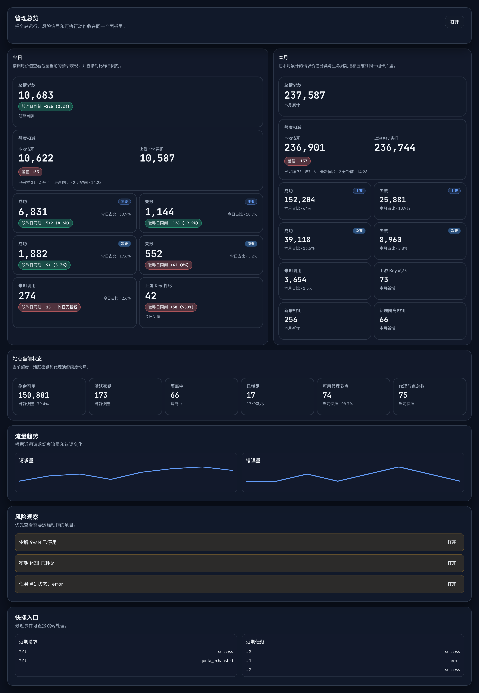

# Admin：管理仪表盘总览加载去重与轻量快照（#66t8u）

## 状态

- Status: 已实现（待审查）
- Created: 2026-04-06
- Last: 2026-04-06

## 背景

- 当前 `/admin/dashboard` 首屏会并行触发 `loadData()` 与 dashboard 专用 overview 请求，两条链路都会拉 `summary`，同时还会连带触发 token page、token groups、recent logs、jobs 等额外请求。
- admin SSE `snapshot` 与首屏 HTTP bootstrap 维护了两套相近但不一致的数据拼装逻辑，既增加后端重复查询，也让前端在同一时间窗口里处理多份重叠数据。
- `/api/summary/windows` 需要扫描 `request_logs` 与配额样本；在 dashboard 首屏、SSE `compute_signatures()` 与 `snapshot` 生成阶段重复执行时，会放大停顿感和后台压力。
- dashboard 可见风险区实际只展示前 5 项，但后端此前仍会为 dashboard 拉分页 keys、分页 logs、facets 与更多不需要的全量数据。

## Goals

- 新增 dashboard 专用轻量聚合接口，首屏只请求一份最小可用 overview 快照。
- 让 admin SSE `snapshot` 与 overview HTTP 复用同一套 payload 构造逻辑，减少重复查询与字段漂移。
- 为 `summary_windows` 增加 2 秒进程内共享缓存，覆盖 dashboard 首屏、SSE 签名与 SSE 快照三条路径。
- 将 dashboard 风险区所需的 `exhausted keys / recent logs / recent jobs / disabled tokens` 改为后端轻量子集查询，不再走分页 + facets + 全量 token 扫描。
- 保持 dashboard 可见功能和核心数据口径不变：期间摘要、当前状态、风险观察、近期请求、近期任务都继续可用。

## Non-goals

- 不修改 `/api/summary`、`/api/jobs`、`/api/logs`、`/api/keys` 现有对其它页面的语义。
- 不调整 dashboard 卡片视觉结构、文案层级或风险排序逻辑。
- 不引入新的数据库 schema 迁移，也不改变 `summary_windows` 的统计 SQL 口径。

## 接口与数据契约

### `GET /api/dashboard/overview`

- 仅管理员可访问。
- 返回 dashboard 首屏真正需要的最小快照：
  - `summary`
  - `summaryWindows`
  - `siteStatus`
  - `forwardProxy`
  - `exhaustedKeys`
  - `recentLogs`
  - `recentJobs`
  - `disabledTokens`
  - `tokenCoverage`
- `summary` 与 `summaryWindows` 结构必须继续与既有接口保持一致。
- `tokenCoverage` 仅允许：
  - `ok`
  - `truncated`
  - `error`

### admin SSE `snapshot`

- `snapshot` 必须复用 `GET /api/dashboard/overview` 的同一份 payload 构造逻辑。
- 顶层保留：
  - `summary`
  - `summaryWindows`
  - `siteStatus`
  - `forwardProxy`
- 顶层新增：
  - `exhaustedKeys`
  - `recentLogs`
  - `recentJobs`
  - `disabledTokens`
  - `tokenCoverage`
- 为兼容历史 dashboard 客户端，继续保留 `keys` 与 `logs` 字段，但其内容改为与 `exhaustedKeys` / `recentLogs` 同步的轻量子集，不再返回旧的全量分页载荷。

### dashboard 轻量查询约束

- exhausted keys：
  - 只取 `status=exhausted` 的前 5 项。
  - 不计算 facets。
- recent logs：
  - 直接复用 summary log 视图，仅取前 5 条。
  - 不返回请求体/响应体。
- recent jobs：
  - 仅取最近 5 条任务。
- disabled tokens：
  - 查询 `enabled = 0 AND deleted_at IS NULL`。
  - 实际查询前 6 条，响应只返回前 5 条。
  - 若存在第 6 条，则 `tokenCoverage = truncated`。

## 行为约束

- dashboard route 首屏加载拆成两层：
  - shell data：`profile`、`version`
  - module data：dashboard overview
- dashboard route 不再通过通用 `loadData()` 拉 `summary`、token page 或 token groups。
- `loadDashboardOverview()` 必须收敛为单请求模型，只调用 `fetchDashboardOverview()`。
- SSE 正常可用时，dashboard 活态增量更新只依赖 `snapshot`；不得再保留独立的 30 秒 dashboard signals polling。
- SSE 断线或 degraded 后，fallback polling 只能刷新 shell data + overview，不得回退到 `loadData()` 与 `loadDashboardOverview()` 双通路并发。
- 手动刷新 dashboard 时，也只能触发 shell data + overview 的一次刷新。

## 性能约束

- `summary_windows` 缓存 TTL 固定为 2 秒，适用于：
  - `GET /api/summary/windows`
  - `GET /api/dashboard/overview`
  - SSE `compute_signatures()`
  - SSE `build_snapshot_event()`
- dashboard HTTP / SSE overview 逻辑不得再触发：
  - logs facets 聚合
  - keys 分页 facets 聚合
  - dashboard 首屏全量 token 扫描
- 首屏进入 dashboard 时，不应再出现两次 `/api/summary` 的并发拉取。

## 验收标准

- `GET /api/dashboard/overview` 未认证返回 `403`，管理员访问返回完整 overview 结构。
- overview 中 `summary`、`summaryWindows` 的值与现有接口保持一致。
- overview 中 `disabledTokens`、`exhaustedKeys`、`recentLogs`、`recentJobs` 都遵守轻量 limit。
- 当禁用 token 数量超过 5 条时，`tokenCoverage = truncated` 且响应只返回前 5 条。
- admin SSE `snapshot` 继续刷新 dashboard 所需字段，但 `keys` / `logs` 兼容别名只承载轻量子集。
- dashboard 首屏不再重复触发 summary/bootstrap 双重加载。
- SSE 正常时，dashboard 不再维持旧的 30 秒 signals polling；SSE 断线后 fallback polling 只刷新 shell data + overview。
- `cargo test`、`cargo clippy -- -D warnings`、`cd web && bun test src/api.test.ts`、`cd web && bun run build`、`cd web && bun run build-storybook` 通过。

## 当前验证记录

- `2026-04-06`：`cargo test --quiet dashboard_overview_` 通过。
- `2026-04-06`：`cargo test --quiet admin_dashboard_sse_snapshot_includes_overview_segments` 通过。
- `2026-04-06`：`cargo test --quiet compute_signatures_tracks_quarantined_key_count` 通过。
- `2026-04-06`：`cargo test admin_dashboard_sse_snapshot_refreshes_when_quota_totals_change -- --nocapture` 通过；期间将 SSE 签名查询进一步瘦身为最小触发集，避免仅为签名轮询拉取完整 logs/token quota。
- `2026-04-06`：`cargo test` 全量通过。
- `2026-04-06`：`cargo clippy -- -D warnings` 通过。
- `2026-04-06`：`cargo fmt` 通过。
- `2026-04-06`：`cd web && bun test src/api.test.ts` 通过。
- `2026-04-06`：`cd web && bun run build` 通过。
- `2026-04-06`：`cd web && bun run build-storybook` 通过。
- `2026-04-06`：使用当前 worktree 的 Storybook 静态预览端口 `127.0.0.1:30020` 打开 `Admin/Components/DashboardOverview/ZhDarkEvidence` iframe，确认 dashboard 总览结构、风险观察与快捷入口在轻量 overview 收敛后保持稳定。

## 实现里程碑

- [x] M1: 新增 dashboard 专用 overview 接口并抽出共享 payload 组装逻辑
- [x] M2: 为 `summary_windows` 引入 2 秒 TTL 共享缓存
- [x] M3: dashboard 风险区改走轻量子集查询与 SSE snapshot 复用
- [x] M4: 前端 dashboard 首屏加载去重，移除旧的 signals polling
- [x] M5: Storybook/mock 视觉证据补齐
- [ ] M6: PR 收口与 merge-ready 状态同步

## 风险与开放点

- 本次优化不改变 `summary_windows` SQL 口径，因此在极端大库场景下，2 秒缓存只能削峰，不能替代更长期的预聚合。
- `snapshot` 仍保留兼容别名 `keys` / `logs`；若后续确认没有其它消费者，可再做一次协议瘦身。
- dashboard 现有 Storybook 证据主要证明 UI 结构保留，不直接证明网络负载下降；性能收益仍以接口去重、payload 收缩与查询复用为主。

## Visual Evidence

- source_type: `storybook_canvas`; story_id_or_title: `Admin/Components/DashboardOverview/ZhDarkEvidence`; state: `dashboard overview preserved after lightweight bootstrap refactor`; evidence_note: 验证 dashboard 在改为单一 overview bootstrap、SSE 复用 payload 与风险区轻量子集后，今日/本月/当前状态、风险观察与快捷入口仍保持既有可见结构。
  PR: include
  

## Change log

- 2026-04-06: 初始化 spec，冻结 dashboard overview 轻量聚合接口、SSE payload 复用、`summary_windows` TTL 缓存与前端 dashboard bootstrap 去重的执行合同。
- 2026-04-06: 完成 dashboard overview 聚合接口、SSE snapshot 复用、轻量风险区查询与前端 dashboard route 去重；随后将 SSE 签名轮询进一步收敛为最小触发查询，并补齐 Storybook 静态预览证据。
