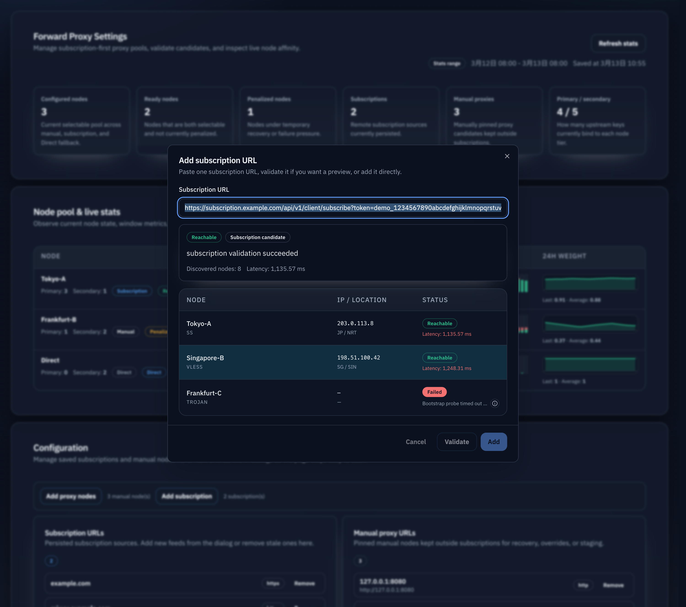
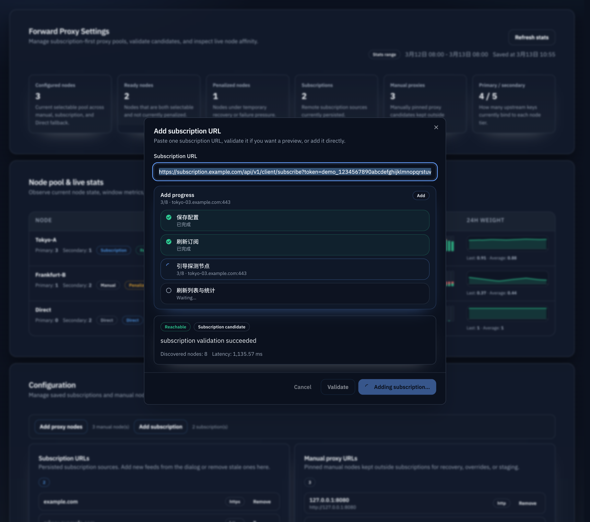
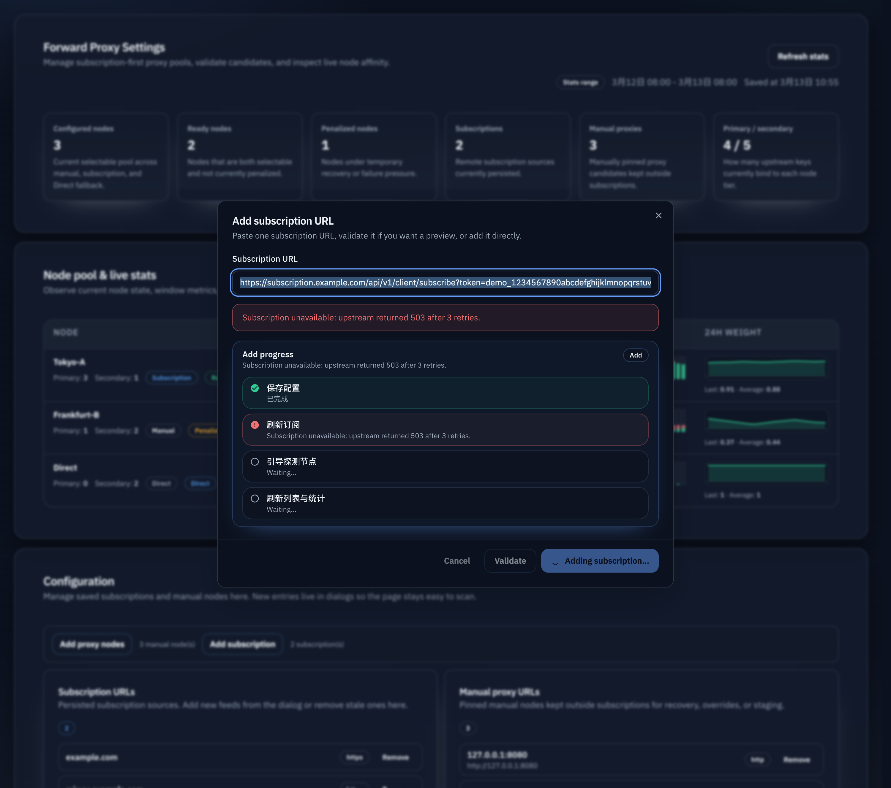

# Forward Proxy 添加/验证进度反馈（#9d66f）

## 状态

- Status: 部分完成（4/5）
- Created: 2026-03-15
- Last: 2026-03-15

## 背景 / 问题陈述

- `/admin/proxy-settings` 的订阅与手工节点弹窗当前只有“验证结果”，没有展示验证/添加过程中真实发生了什么。
- 订阅验证最长可占用完整订阅验证预算，添加流程还会串行执行 settings 保存、subscription refresh 与 bootstrap probe，用户会误以为界面卡死。
- 缺少按钮 loading 与阶段性反馈时，主人无法判断当前是在拉取订阅、探测节点、还是保存后的后台刷新阶段。

## 目标 / 非目标

### Goals

- 为 forward proxy 弹窗的“验证可用性”与“添加/导入”路径补上即时 spinner、真实进度气泡与失败留痕。
- 在不破坏现有 JSON 接口兼容性的前提下，为 `PUT /api/settings/forward-proxy` 与 `POST /api/settings/forward-proxy/validate` 增加 `text/event-stream` 进度模式。
- 让前端基于稳定 `phaseKey` 展示中英双语步骤，并在 probe 阶段显示 `current/total`。

### Non-goals

- 不调整 forward proxy timeout、probe 预算、调度或节点选择策略。
- 不把这套进度流扩散到 API keys、jobs 或其他 admin 模块。
- 不重做弹窗整体布局与结果表，只补充进度反馈区与 loading affordance。

## 接口契约（Interfaces & Contracts）

### HTTP API

- `PUT /api/settings/forward-proxy`
  - `Accept` 不包含 `text/event-stream`：保持现有 JSON `ForwardProxySettingsResponse`。
  - `Accept` 包含 `text/event-stream`：返回 SSE，消息体为 JSON envelope。
- `POST /api/settings/forward-proxy/validate`
  - `Accept` 不包含 `text/event-stream`：保持现有 JSON `ForwardProxyValidationView`。
  - `Accept` 包含 `text/event-stream`：返回 SSE，消息体为 JSON envelope。

### Progress Envelope

- `type=phase`
  - 字段：`operation`、`phaseKey`、`label`、可选 `current`、`total`、`detail`
- `type=complete`
  - 字段：`operation`、`payload`
  - `payload` 必须与当前 endpoint 的现有 JSON 完成态完全一致
- `type=error`
  - 字段：`operation`、`message`、可选 `phaseKey`、`label`、`current`、`total`、`detail`

### 固定 phaseKey

- Validate（subscription）: `normalize_input` → `fetch_subscription` → `probe_nodes` → `generate_result`
- Validate（manual）: `parse_input` → `probe_nodes` → `generate_result`
- Save（shared backend phases）: `save_settings` → `refresh_subscription`（仅 subscription 路径）→ `bootstrap_probe`
- Save（frontend local completion phase）: `refresh_ui`

## 功能与行为规格

- 点击 `验证可用性` 后：
  - 触发按钮立即进入 spinning + disabled。
  - 弹窗 body 在结果区域上方或结果区域前展示步骤气泡列表。
  - SSE `phase` 到来时，当前步骤切为进行中，已完成步骤切为成功。
- 点击 `添加` / `导入可用项` 后：
  - 对应提交按钮立即进入 spinning + disabled。
  - SSE 反馈保存、订阅刷新、bootstrap probe；前端在收到 `complete` 后继续显示本地 `refresh_ui`，直到 settings/stats 刷新完成再关闭弹窗。
- 任一步骤失败：
  - 弹窗保持打开。
  - 当前步骤标记失败，并在现有错误区域保留错误文案。
  - 已完成验证结果不得被错误覆盖或清空，除非本次流程尚未产生结果。

## 验收标准（Acceptance Criteria）

- Given 管理员在订阅或手工节点弹窗点击 `验证可用性`
  When 请求尚未完成
  Then 对应按钮立即显示 spinning，且步骤气泡按真实阶段推进。

- Given 管理员添加 subscription URL
  When 后端依次执行保存、订阅刷新、bootstrap probe
  Then 页面依次显示对应步骤，而不是静默等待。

- Given probe 阶段存在多个待探测节点
  When SSE 持续发回 `probe_nodes` 或 `bootstrap_probe`
  Then 前端能显示 `current/total`，让用户知道当前进度。

- Given 任一步骤失败
  When SSE 发回 `error`
  Then 弹窗保持打开、失败步骤高亮、错误文案可见，且重复提交仍被阻止直到本次流程收尾。

- Given 后端或测试环境不返回 SSE
  When 前端收到普通 JSON
  Then 流程仍能完成，且不会破坏现有 settings/validation 兼容行为。

## 测试与证据

- Rust：补充 validate/save 的 SSE route 测试，验证 phase 顺序、complete payload 与 error envelope。
- Web：补充 progress stream parser/helper 测试与 forward proxy dialog progress reducer/render 测试。
- Storybook：新增 `SubscriptionValidatingProgress`、`SubscriptionAddingProgress`、`ManualValidatingProgress`、`ProgressFailure`。
- Browser：在 mock/stub upstream 下验证订阅添加与手工验证流程的按钮 spinner、步骤气泡与失败收尾。

## Visual Evidence (PR)

- source_type: storybook_canvas
  target_program: mock-only
  capture_scope: browser-viewport
  sensitive_exclusion: N/A
  submission_gate: pending-owner-approval
  story_id_or_title: `Admin/ForwardProxySettingsModule/SubscriptionValidationSuccess`
  state: `success`
  evidence_note: 验证成功后弹窗直接切换到节点列表，展示节点名称、协议、IP/地理位置与结果列延迟。

- source_type: storybook_canvas
  target_program: mock-only
  capture_scope: browser-viewport
  sensitive_exclusion: N/A
  submission_gate: pending-owner-approval
  story_id_or_title: `Admin/ForwardProxySettingsModule/SubscriptionAddingProgress`
  state: `saving`
  evidence_note: 导入进行中展示保存配置、刷新订阅、引导探测与刷新列表的分阶段进度，而不是静默等待。

- source_type: storybook_canvas
  target_program: mock-only
  capture_scope: browser-viewport
  sensitive_exclusion: N/A
  submission_gate: pending-owner-approval
  story_id_or_title: `Admin/ForwardProxySettingsModule/ProgressFailure`
  state: `error`
  evidence_note: 订阅刷新失败时保留错误气泡与失败步骤，证明弹窗不会在异常时静默关闭。

## 里程碑（Milestones / Delivery checklist）

- [x] M1: 新增 spec 与 README 索引，冻结 progress envelope / phaseKey / fallback 口径
- [x] M2: 后端 validate/save 增加 SSE 进度输出并保留 JSON fallback
- [x] M3: 前端弹窗接入 spinner + 步骤气泡 + 进度流消费
- [x] M4: 补齐 i18n、Storybook、Rust/Bun 测试与浏览器验收
- [ ] M5: fast-flow push / PR / checks / review-loop 收敛
