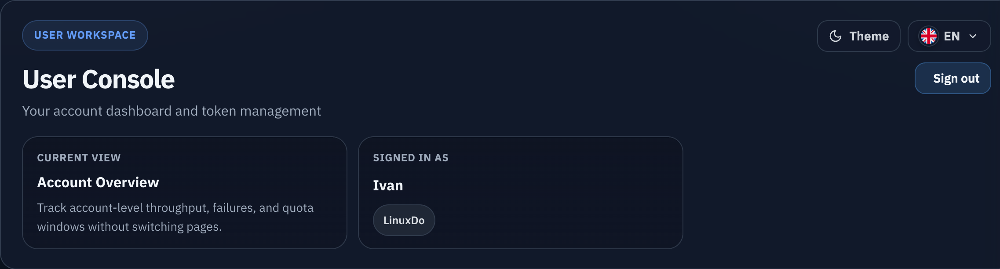
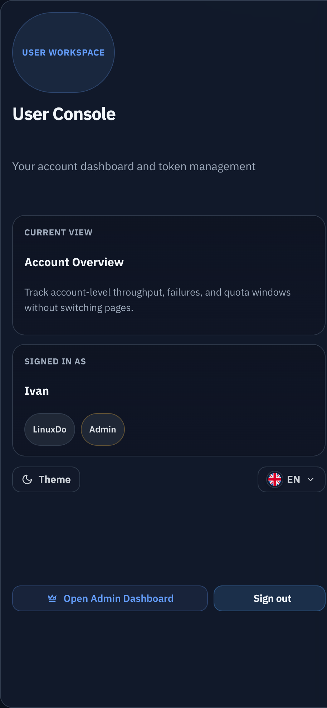
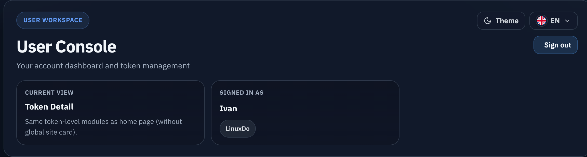

# 用户控制台页头重设计与退出登录

## 状态

- Status: 已实现（待审查）
- Created: 2026-04-09
- Last: 2026-04-09

## 背景 / 问题陈述

- 当前 `/console` 复用了偏后台语义的 `admin-panel-header`，用户控制台缺少专属的信息层级与视觉识别。
- 现有页头只展示标题、副标题与管理员入口，登录身份、当前视图上下文与关键操作没有形成稳定的 Hero 区。
- 后端已经提供 `POST /api/user/logout`，但前端用户控制台尚未暴露退出登录入口。
- 本轮是 UI-affecting follow-up，必须同时补齐 Storybook 验收入口、视觉证据与退出链路验证。

## 目标 / 非目标

### Goals

- 为 `/console` landing 与 token detail 引入用户控制台专属 Hero 页头，不再直接复用后台页头视觉。
- Hero 至少清晰呈现：控制台标题、稳定副标题、当前视图上下文、登录身份（用户 + provider）与操作区。
- 复用现有 `POST /api/user/logout` 增加退出登录按钮，并在成功退出后返回首页 `/`。
- 保留并重新排布现有主题切换、语言切换与管理员入口，保证 mobile/admin 紧凑态不裁切。
- 更新 Storybook、前端测试与 spec 视觉证据，使本轮变更可以稳定验收。

### Non-goals

- 不修改 Rust 用户认证/会话 schema、OAuth 流程或新增后端接口。
- 不重做 `/admin` 页面页头或通用 `AdminPanelHeader` 契约。
- 不调整用户控制台的 dashboard、token list、probe 与日志业务逻辑。

## 范围（Scope）

### In scope

- `web/src/UserConsole.tsx`
- `web/src/api.ts`
- `web/src/index.css`
- `web/src/UserConsole.stories.tsx`
- `web/src/UserConsole.stories.test.ts`
- `web/src/UserConsole.test.ts`
- `web/src/api.test.ts`
- `web/src/components/UserConsoleHeader.tsx`
- `web/src/components/UserConsoleHeader.test.tsx`
- `docs/specs/g9bxz-user-console-header-logout/SPEC.md`
- `docs/specs/README.md`

### Out of scope

- `src/server/**` Rust handlers 与数据库变更。
- `/admin` 或 PublicHome 的视觉改版。
- 用户 token 生命周期写操作。

## 接口契约（Interfaces & Contracts）

- 继续复用现有 `GET /api/profile` 字段：`isAdmin`、`userLoggedIn`、`userProvider`、`userDisplayName`。
- 继续复用现有 `POST /api/user/logout`：
  - `204` 视为退出成功；
  - `401` 视为会话已失效，也按已退出处理；
  - 其他非 2xx 继续作为错误上抛给页头/页面错误反馈。
- 不新增后端路由、schema、cookie 字段或前端 public contract。

## 验收标准（Acceptance Criteria）

- Given 已登录用户访问 `/console`
  When 页面加载 landing 或 token detail
  Then 顶部展示用户控制台专属 Hero 页头，且能一眼看到标题、副标题、当前视图、登录身份与操作区。

- Given `profile.userLoggedIn === true`
  When 用户点击退出登录
  Then 前端调用 `POST /api/user/logout`，按钮进入 loading/disabled，成功或 `401` 后跳回 `/`。

- Given 退出请求返回 `5xx` 或网络错误
  When 用户点击退出登录
  Then 当前页面保持不跳转，并展示可见错误反馈。

- Given 管理员用户访问 `/console`
  When 页头同时展示管理员入口、主题/语言切换与退出按钮
  Then desktop 与 mobile 紧凑态都不出现裁切、挤压失控或按钮不可点击。

- Given `console unavailable` 或 admin-only/dev-open-admin 态
  When 页面渲染页头
  Then 不显示用户退出按钮。

- Given UserConsole Storybook
  When 验收者打开普通用户 desktop 与管理员 mobile 入口
  Then 可以稳定复核新页头的布局与显隐差异，而无需依赖临时运行态。

## 非功能性验收 / 质量门槛（Quality Gates）

### Testing

- `cd web && bun test`
- `cd web && bun run build`
- `cd web && bun run build-storybook`

### UI / Storybook

- Storybook 保留稳定的 desktop 普通用户态与 mobile/admin 紧凑态入口。
- 视觉证据优先来自 Storybook；若需要退出链路证明，可补浏览器真实预览证据。

## Visual Evidence

- 证据类型：`source_type=storybook_canvas`，`target_program=mock-only`，`capture_scope=element`
- 关联 story：`User Console/UserConsole > ConsoleHome`
- 证明点：desktop 普通用户态页头已改为专属 Hero，稳定展示标题、副标题、当前视图、登录身份，以及主题/语言/退出登录操作。

- 证据类型：`source_type=storybook_canvas`，`target_program=mock-only`，`capture_scope=element`
- 关联 story：`User Console/UserConsole > ConsoleHomeAdminMobile`
- 证明点：mobile/admin 最紧凑布局下，管理员入口、退出按钮与主题/语言切换可同时容纳，无裁切或失控换行。

- 证据类型：`source_type=storybook_canvas`，`target_program=mock-only`，`capture_scope=element`
- 关联 story：`User Console/UserConsole > TokenDetailOverview`
- 证明点：token detail 与 landing 共用同一套 Hero 结构，只替换当前视图上下文，不再分叉成独立页头逻辑。

- 浏览器验证：当前 worktree backend `http://127.0.0.1:58087/console` 以本地 seeded 用户会话完成真实链路验证，点击“退出登录”后触发 `POST /api/user/logout`（204），随后跳回 `/`，并恢复公开首页的 LinuxDo 登录入口。

## 风险 / 开放问题 / 假设

- 风险：页头信息量增加后，最窄 mobile/admin 组合可能出现按钮换行与内容裁切。
- 风险：Storybook 环境若直接点击退出按钮可能离开预览，需要让证据 capture 避免误触。
- 假设：`userDisplayName` 与 `userProvider` 已足以表达用户身份；当两者缺失时允许降级显示 admin/匿名态。

## 变更记录（Change log）

- 2026-04-09: 创建 follow-up spec，冻结用户控制台专属 Hero 页头与退出登录的实现边界。
