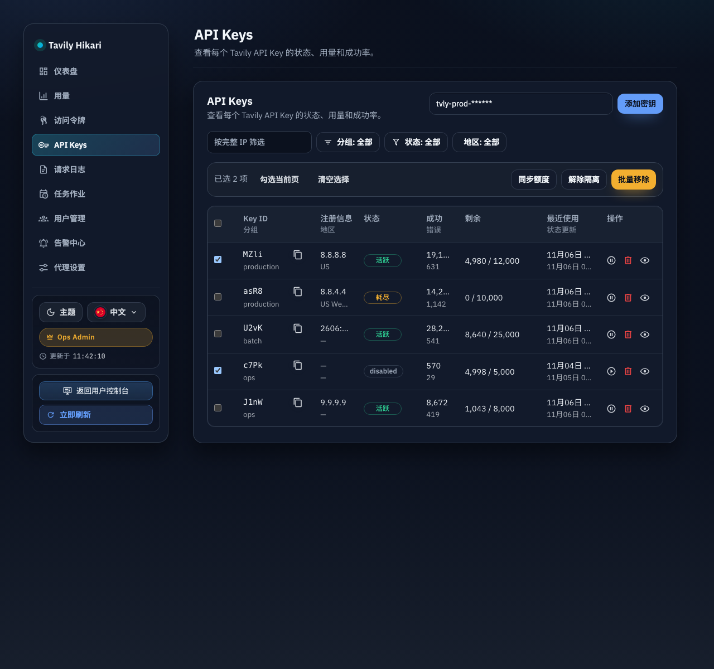
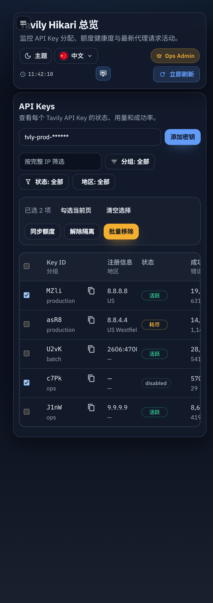
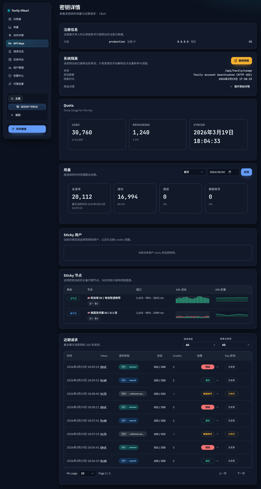

# Admin API Keys 批量维护动作与状态无关手动同步（#hrre9）

## 状态

- Status: 已实现
- Created: 2026-04-04
- Last: 2026-04-05

## 背景 / 问题陈述

- `/admin/keys` 目前只有逐条操作，批量清理异常 key、批量解除隔离或批量刷新额度都需要重复点击，实际维护成本高。
- 现有“同步额度”入口只覆盖单 key，且本次需求要求管理员手动同步不再受本地 key 状态约束。
- 额度同步一旦上游失败，不能把错误结果写回当前额度快照，否则会污染后续判断与展示。

## 目标 / 非目标

### Goals

- 在 `/admin/keys` 新增“当前页勾选”批量操作：删除、解除隔离、同步额度。
- 让管理员手动同步入口（列表批量同步 + 详情页单 key 同步）对 `active` / `disabled` / `exhausted` / `quarantined` 一视同仁，都允许发起。
- 保证同步失败不写入错误额度数据，同时保持现有上游失败分类、错误返回与 quarantine 副作用不变。
- 补齐 Storybook、浏览器视觉证据、测试与 PR 收敛所需 spec 合同。

### Non-goals

- 不支持“全选当前筛选结果”或跨页批量操作。
- 不新增列表单条“同步额度”按钮。
- 不放开后台热/冷 quota sync scheduler 对 `quarantined` / `exhausted` key 的筛选。
- 不修改上游 usage 失败时的 quarantine / audit 语义。

## 范围（Scope）

### In scope

- `docs/specs/hrre9-admin-api-keys-bulk-actions/**`
  - 新 spec、HTTP contract 与视觉证据。
- `src/server/handlers/admin_resources.rs` / `src/server/serve.rs`
  - 新增 admin 批量维护接口。
- `src/tavily_proxy/mod.rs` / `src/store/mod.rs`
  - 复用删除、解除隔离、同步额度原语，并为批量同步提供失败不落坏数据的保证。
- `src/server/tests.rs` / `src/tests/mod.rs`
  - 后端 mixed-status/mixed-result 覆盖。
- `web/src/AdminDashboard.tsx` / `web/src/api.ts` / `web/src/i18n.tsx`
  - 当前页勾选、批量工具条、批量确认/执行、详情页同步回归。
- Storybook stories / browser validation
  - API Keys 列表选中态与详情页非 active 同步态。

### Out of scope

- API Keys 列表新增排序、搜索或跨页批量协议。
- 现有 key 导入、校验对话框和分页 URL 契约的结构性重做。
- 非管理员侧页面与用户控制台。

## 需求（Requirements）

### MUST

- 桌面表格与移动卡片都支持“当前页勾选”与“全选当前页”。
- 批量操作仅对当前页已勾选 key 生效；翻页、改筛选、改 `perPage`、刷新后必须清空选择。
- 新增 `POST /api/keys/bulk-actions`，支持 `delete` / `clear_quarantine` / `sync_usage`。
- 管理员手动同步不得因本地 key 状态而拒绝发起。
- 同步失败不得写入 `api_keys.quota_limit`、`api_keys.quota_remaining`、`api_keys.quota_synced_at`，也不得写 `api_key_quota_sync_samples`。

### SHOULD

- 批量操作响应提供 summary + per-key 结果，前端据此反馈部分成功/失败。
- 解除隔离对 no-op 项返回 `skipped`，而不是整批失败。
- 列表操作完成后统一刷新当前 keys 页并清空选择。

### COULD

- 在前端展示简短的批量执行结果摘要。

## 功能与行为规格（Functional/Behavior Spec）

### Core flows

- API Keys 列表新增选择列；桌面表头支持全选/取消全选当前页，移动卡片每项提供独立勾选。
- 当当前页存在选中项时，列表头部显示批量工具条，提供：
  - 删除：二次确认后执行。
  - 解除隔离：直接执行。
  - 同步额度：直接执行。
- 批量执行期间锁定对应按钮，避免重复提交。
- 列表批量同步与详情页单 key 同步共用相同的“手动同步”语义：只受“当前请求进行中”约束，不受 key 本地状态约束。
- 批量执行后，前端刷新当前 keys 页、清空选择，并展示 summary 级反馈。

### Edge cases / errors

- 批量 `clear_quarantine` 遇到非隔离 key 时返回 `skipped`。
- 批量 `delete` 对已 soft-delete 的 key 若仍被请求，允许按幂等思路返回 `success` 或 `skipped`，但不得破坏既有 undelete 语义。
- 批量 `sync_usage` 某些 key 上游失败时，其余 key 继续执行；失败项只回报错误，不写坏数据。
- 详情页单 key 同步上游失败时，仍允许既有 quarantine/audit 副作用继续发生，但额度快照不得被污染。

## 接口契约（Interfaces & Contracts）

### 接口清单（Inventory）

| 接口（Name）                    | 类型（Kind） | 范围（Scope） | 变更（Change） | 契约文档（Contract Doc）   | 负责人（Owner） | 使用方（Consumers） | 备注（Notes）                  |
| ------------------------------- | ------------ | ------------- | -------------- | -------------------------- | --------------- | ------------------- | ------------------------------ |
| `POST /api/keys/bulk-actions`   | HTTP API     | internal      | New            | `./contracts/http-apis.md` | backend         | admin web           | API Keys 列表批量维护动作      |
| `POST /api/keys/:id/sync-usage` | HTTP API     | internal      | Modify         | `./contracts/http-apis.md` | backend         | admin web           | 语义补强：本地状态无关手动同步 |

### 契约文档（按 Kind 拆分）

- [contracts/http-apis.md](./contracts/http-apis.md)

## 验收标准（Acceptance Criteria）

- Given `/admin/keys` 当前页存在多条 key
  When 勾选部分或全选当前页
  Then 桌面与移动端显示一致的选中数量，且翻页、改 `perPage`、改任一筛选、手动刷新后选择立即清空。

- Given 选中的 key 混合了 `active`、`disabled`、`exhausted`、`quarantined`
  When 执行批量同步额度
  Then 所有选中 key 都会发起同步请求；本地状态不会让任一 key 在前端或后端被预先拒绝。

- Given 某些批量同步请求上游返回 `401` / `403` / `5xx`
  When 批量操作结束
  Then 成功项更新额度，失败项返回 `failed`；失败项不得更新 `quota_limit / quota_remaining / quota_synced_at`，也不得写 quota sync sample。

- Given 选中的 key 中只有一部分处于隔离中
  When 执行批量解除隔离
  Then 已隔离项成功解除，非隔离项以 `skipped` 回报，整批不因 no-op 项失败。

- Given 批量删除完成
  When 列表刷新
  Then 已删除 key 从当前列表消失，重新添加同 secret 仍保持既有 undelete 语义。

- Given Storybook 与浏览器验收已完成
  When 进入 PR 收敛
  Then spec 的 `## Visual Evidence` 已包含列表批量操作与详情页同步的最终图片，且图片已在对话中回传给主人。

## 实现前置条件（Definition of Ready / Preconditions）

- 目标/非目标、范围、状态无关手动同步边界已冻结。
- 批量接口请求/响应合同已定稿。
- “其他地方”已明确仅覆盖管理员手动同步入口，不扩到后台自动调度。
- UI 证据来源明确为 Storybook + 浏览器真实页面。

## 非功能性验收 / 质量门槛（Quality Gates）

### Testing

- Unit tests: 前端选择/批量 helper 相关测试（如新增 helper）。
- Integration tests: `POST /api/keys/bulk-actions`、单 key 手动同步失败不落坏数据、mixed-status 批量同步/解除隔离/删除。
- E2E tests (if applicable): 浏览器验证 `/admin/keys` 选中与批量动作、`/admin/keys/:id` 非 active 同步。

### UI / Storybook (if applicable)

- Stories to add/update: API Keys 列表选中/批量工具条、KeyDetails 非 active 同步态。
- Docs pages / state galleries to add/update: 复用现有 stories/docs 能力，为本次状态提供稳定入口。
- `play` / interaction coverage to add/update: 至少覆盖批量工具条显隐或详情页同步按钮状态。
- Visual regression baseline changes (if any): none。

### Quality checks

- `cargo test`
- `cd web && bun test`
- `cd web && bun run build`

## 文档更新（Docs to Update）

- `docs/specs/README.md`: 新增 spec 索引并在实现推进时同步状态。
- `docs/specs/hrre9-admin-api-keys-bulk-actions/SPEC.md`: 维护里程碑、验证记录与视觉证据。

## 计划资产（Plan assets）

- Directory: `docs/specs/hrre9-admin-api-keys-bulk-actions/assets/`
- In-plan references: ``
- Visual evidence source: maintain `## Visual Evidence` in this spec when owner-facing or PR-facing screenshots are needed.

## Visual Evidence

- Storybook覆盖=通过
- 视觉证据目标源=storybook_canvas
- 视觉证据=存在
- 空白裁剪=已裁剪（移动端列表图因边界不稳定保留原图；桌面最终证据保留完整 xl 原图）
- 聊天回图=已展示
- 证据落盘=已落盘
- 证据绑定sha=待提交

### API Keys 列表（桌面）

### API Keys 列表（移动）

### KeyDetails 手动同步

## 资产晋升（Asset promotion）

None

## 实现里程碑（Milestones / Delivery checklist）

- [x] M1: 新增 spec、HTTP contract 与索引项
- [x] M2: 后端批量维护接口与同步安全约束落地
- [x] M3: 前端列表选择、批量工具条、详情页同步回归落地
- [x] M4: 测试、Storybook/浏览器证据与 PR 收敛完成

## 方案概述（Approach, high-level）

- 复用已有逐条 delete / clear quarantine / sync usage 原语，由新批量接口负责逐 key 调度、结果聚合与部分成功表达。
- 前端选择状态只绑定当前页渲染结果，不引入跨页状态机，确保与现有分页 URL 契约兼容。
- 手动同步的状态无关语义只在管理员手动入口生效，避免扩大到后台 scheduler。

## 风险 / 开放问题 / 假设（Risks, Open Questions, Assumptions）

- 风险：列表桌面/移动端需要共享同一份选择状态，若实现分叉，容易出现选中计数不一致。
- 风险：批量同步若直接复用现有手动同步逻辑，需要确认 job 记录与失败聚合不会引入额外噪音。
- 假设：批量删除允许保持 soft-delete 幂等语义，不需要额外区分“已删除”错误。

## 变更记录（Change log）

- 2026-04-04: 初始化 spec，冻结批量维护动作、状态无关手动同步与失败不落坏数据范围。
- 2026-04-04: 完成后端批量动作接口、前端当前页勾选/批量工具条、Storybook 入口与视觉证据落盘。

## 参考（References）

- `docs/specs/km4gk-admin-api-keys-pagination-url-sync/SPEC.md`
- `docs/specs/kgakn-admin-api-keys-validation-dialog/SPEC.md`
