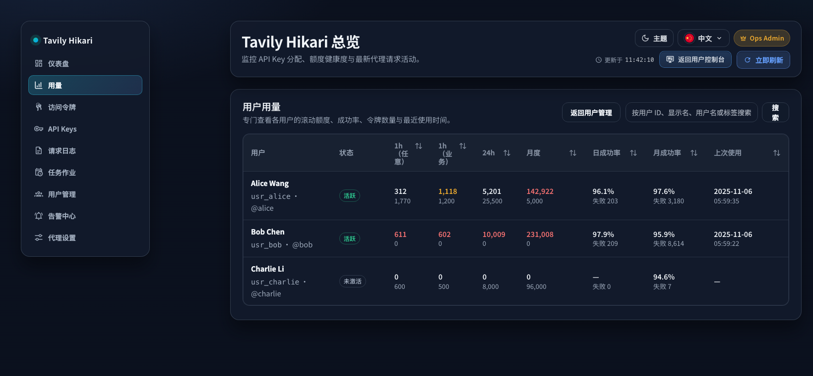
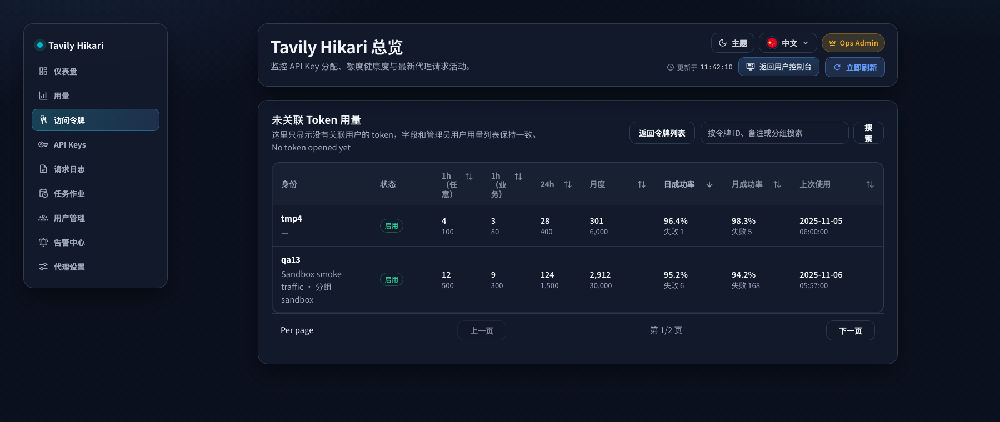
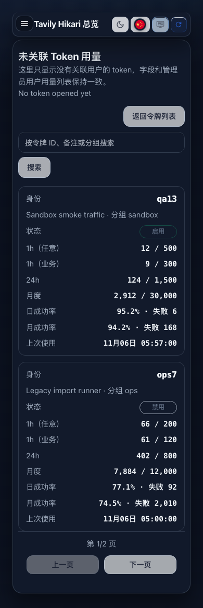

# Admin 未关联 Token 用量列表替换旧排行榜（#jh5hs）

## 状态

- Status: 已完成（快车道）
- Created: 2026-03-27
- Last: 2026-03-29

## 背景 / 问题陈述

- `/admin/tokens/leaderboard` 仍是旧的排行榜式视图，只支持“今日 / 本月 / 全部”与“用量 / 错误 / 其他”的排行切换。
- 主人要求该页面升级为“未关联用户 Token 用量列表”，并且字段与 `/admin/users/usage` 保持一致，便于直接按同一运营心智查看无人认领 token 的额度与成功率。
- 现有排行榜接口与前端状态模型都围绕榜单排序构建，无法直接承载搜索、分页、成功率排序与未绑定过滤。

## 目标 / 非目标

### Goals

- 保留 `/admin/tokens/leaderboard` 路径，但将其语义替换为“未关联 Token 用量列表”。
- 新页面桌面表格与移动卡片按 `/admin/users/usage` 对齐，字段固定为：身份、状态、1 小时（任意）、1 小时（业务）、24 小时、本月、日成功率、月成功率、最近使用。
- 仅展示 `owner == null` 的 token；已绑定用户的 token 绝不出现在此页。
- 提供搜索、排序、分页，并让排序字段与用户用量页同构。
- 补齐 Storybook 页面级覆盖、视觉证据、快车道 PR 收口与 spec sync。

### Non-goals

- 不改 `/admin/tokens` 常规列表页的字段、筛选、分页或批量操作。
- 不调整 token 绑定语义、用户用量页接口契约、用户详情页或 token detail 页布局。
- 不保留旧排行榜的 period/focus 分段筛选，也不新增 owner/tag 维度过滤。

## 范围（Scope）

### In scope

- `src/server/handlers/admin_resources.rs` / `src/server/serve.rs`
  - 新增 admin-only `GET /api/tokens/unbound-usage`，支持 `page`、`per_page`、`q`、`sort`、`order`。
  - 输出分页列表，仅返回未绑定 token 的用量行。
- `src/store/mod.rs` / `src/tavily_proxy/mod.rs` / `src/models.rs`
  - 新增 token 维度批量日志指标聚合，提供 `daily_success`、`daily_failure`、`monthly_success`、`monthly_failure` 与 `last_activity`。
  - 复用现有 token 配额快照与 hourly-any 快照，不引入用户级混算。
- `src/server/tests.rs` / `src/server/handlers/admin_resources.rs` 内部测试
  - 覆盖未绑定过滤、搜索、排序、分页 total 与空结果。
- `web/src/api.ts`
  - 新增未绑定 token 用量列表类型与 fetch 函数，替换页面对旧排行榜类型的依赖。
- `web/src/AdminDashboard.tsx` / `web/src/admin/routes.ts` / `web/src/i18n.tsx`
  - 将 `tokenLeaderboard*` 页面消费链路迁移为 `unboundTokenUsage*`。
  - 页面主体改成用户用量风格表格 / 移动卡片，并同步更新入口按钮与文案。
- `web/src/admin/AdminPages.stories.tsx`
  - 增加未绑定 token 用量页的 desktop、mobile、empty、error 画布与关键 `play`。

### Out of scope

- `/api/tokens`、`/api/tokens/:id`、`/api/users` 原有协议。
- token detail 的返回上下文记忆与额外导航重构。
- 旧排行榜接口以外的任何公共 API。

## 接口契约（Interfaces & Contracts）

### Public / external interfaces

- 新增 `GET /api/tokens/unbound-usage?page=&per_page=&q=&sort=&order=`

返回：

```json
{
  "items": [
    {
      "tokenId": "xa13",
      "enabled": true,
      "note": "manual-unbound",
      "group": null,
      "hourlyAnyUsed": 12,
      "hourlyAnyLimit": 500,
      "quotaHourlyUsed": 8,
      "quotaHourlyLimit": 300,
      "quotaDailyUsed": 41,
      "quotaDailyLimit": 1500,
      "quotaMonthlyUsed": 380,
      "quotaMonthlyLimit": 3000,
      "dailySuccess": 21,
      "dailyFailure": 3,
      "monthlySuccess": 220,
      "monthlyFailure": 17,
      "lastUsedAt": 1774606800
    }
  ],
  "total": 1,
  "page": 1,
  "perPage": 20
}
```

- 搜索范围固定为 `tokenId + note + group`，大小写不敏感，空白 query 等同不筛选。
- 排序字段固定为 `hourlyAnyUsed | quotaHourlyUsed | quotaDailyUsed | quotaMonthlyUsed | dailySuccessRate | monthlySuccessRate | lastUsedAt`。
- 默认排序为 `lastUsedAt desc`。

### Internal interfaces

- 新增 token 维度 `fetch_token_log_metrics_bulk(token_ids)`，按 token 聚合：
  - `daily_success`
  - `daily_failure`
  - `monthly_success`
  - `monthly_failure`
  - `last_activity`
- 新页面 DTO 与排序逻辑共用一套后端行结构，避免桌面/移动端字段漂移。

## 验收标准（Acceptance Criteria）

- Given 管理员访问 `/admin/tokens/leaderboard`
  When 页面完成渲染
  Then 标题、描述与入口 tooltip 不再出现“排行榜 / leaderboard”语义。

- Given 存在已绑定与未绑定 token 混合数据
  When 请求 `/api/tokens/unbound-usage`
  Then 返回结果只包含 `owner == null` 的 token。

- Given 管理员在新页面执行搜索、排序、翻页
  When 条件变化
  Then 行为与 `/admin/users/usage` 一致，且搜索/排序变化时分页回到第一页。

- Given 管理员点击身份列或移动端卡片动作
  When 触发导航
  Then 进入对应 `/admin/tokens/:id`。

- Given Storybook 打开未绑定 token 用量页故事
  When 切换到 desktop/mobile/empty/error 场景
  Then 画布稳定展示对应状态，并包含至少一个排序交互与一个 token detail 导航交互覆盖。

## 非功能性验收 / 质量门槛（Quality Gates）

### Testing

- `cargo test`
- `cargo clippy -- -D warnings`
- `cd web && bun run build`
- 相关前端测试与 Storybook 检查

### UI / Storybook

- 必须新增页面级 Storybook 覆盖，不得只保留单一 Default story。
- 必须先从 Storybook 产出视觉证据，再进入 merge-ready 收口。

## Visual Evidence

- source_type: storybook_canvas
  target_program: mock-only
  capture_scope: browser-viewport
  sensitive_exclusion: N/A
  submission_gate: approved
  story_id_or_title: Admin/Pages/UsersUsage
  state: desktop usage table baseline after shared column-width and label alignment fixes
  evidence_note: 证明 `/admin/users/usage` 的共用用量表已经完成同一轮列宽回收、状态徽标完整显示与表头文案对齐，并保留英文 locale 下的本地化日期显示，可作为未关联 token 页面同构布局的对照基线。
  PR: include
  image:
  

- source_type: storybook_canvas
  target_program: mock-only
  capture_scope: browser-viewport
  sensitive_exclusion: N/A
  submission_gate: approved
  story_id_or_title: Admin/Pages/UnboundTokenUsage
  state: desktop table with aligned usage headers, balanced column widths, and no status truncation
  evidence_note: 证明 `/admin/tokens/leaderboard` 已替换成未关联 token 用量表格，且桌面表头、状态徽标与列宽分配已经与用户用量页完成同构对齐，没有额外省略号或尾部留白。
  PR: include
  image:
  

- source_type: storybook_canvas
  target_program: mock-only
  capture_scope: browser-viewport
  sensitive_exclusion: N/A
  submission_gate: approved
  story_id_or_title: Admin/Pages/UnboundTokenUsageMobile
  state: mobile cards with tightened shell spacing, dedicated identity header, and compact pagination footer
  evidence_note: 证明移动端已同步切换为未关联 token 用量卡片，并完成窄视口外层留白收紧、身份块重排和分页器移动布局优化，不再出现身份信息横向挤压或孤立的 per-page 占位。
  PR: include
  image:
  

## 实现里程碑（Milestones / Delivery checklist）

- [x] M1: 冻结新页面契约、路径保留策略与验收口径
- [x] M2: 后端未绑定 token 用量接口与测试完成
- [x] M3: 前端页面、文案、入口与交互替换完成
- [x] M4: Storybook 覆盖与视觉证据完成
- [x] M5: 快车道验证、review-loop、spec sync 与 merge-ready 收口完成

## 风险 / 开放问题 / 假设

- 风险：若沿用旧排行榜 N+1 汇总方式，token 数量稍大时会拖慢页面加载，需要批量聚合日志指标。
- 风险：若只改桌面表格不改移动卡片与 Storybook mock，响应式与验收源会漂移。
- 假设：默认排序使用 `lastUsedAt desc`，以贴近运营排障优先级。
- 假设：身份列主文案固定展示 `tokenId`，次级信息展示 `note` 与 `group`，不再展示 owner 占位。

## 变更记录（Change log）

- 2026-03-27: 创建快车道 spec，冻结“用未关联 token 用量列表替换旧排行榜”的路径、接口、页面与验收范围。
- 2026-03-28: 后端新增 `/api/tokens/unbound-usage` 与 token 维度批量日志聚合，过滤 `owner == null` 后支持搜索、排序、分页与成功率/最近使用排序。
- 2026-03-28: 前端将 `/admin/tokens/leaderboard` 替换为未关联 token 用量页，复用用户用量列表的桌面表格、移动卡片、分页、排序与 token detail 导航。
- 2026-03-28: Storybook 补齐 desktop/mobile/empty/error 与交互覆盖，并在共享用量表列宽、表头文案与状态徽标修正后重新落盘用户用量桌面图、未关联 token 桌面图与移动图，等待主人确认后进入 push/PR 收口。
- 2026-03-28: review-loop 补齐 token detail 返回未关联 token 用量页的上下文保留，确保从 `/admin/tokens/leaderboard` 进入详情后可带着搜索、排序与分页返回原列表。
- 2026-03-28: review-loop 继续修复全局 refresh 未刷新未关联 token 列表、`Last Used` 升序对 never-used token 的排序方向，以及英文 admin 页 stacked timestamp 本地化日期回归，并据此重拍最新 Storybook 证据图等待主人重新确认。
- 2026-03-29: 根据主人验收继续收紧 390px 窄视口的 admin shell / panel 横向留白，补齐未关联 token 移动卡片的身份头部布局与分页器移动端两行结构，并同步更新最终移动端证据图。

## 参考（References）

- `web/src/AdminDashboard.tsx`
- `src/server/handlers/admin_resources.rs`
- `docs/specs/hwrpf-admin-user-usage-hide-token-count/SPEC.md`
- `docs/specs/27ypg-admin-token-owner-visibility/SPEC.md`
