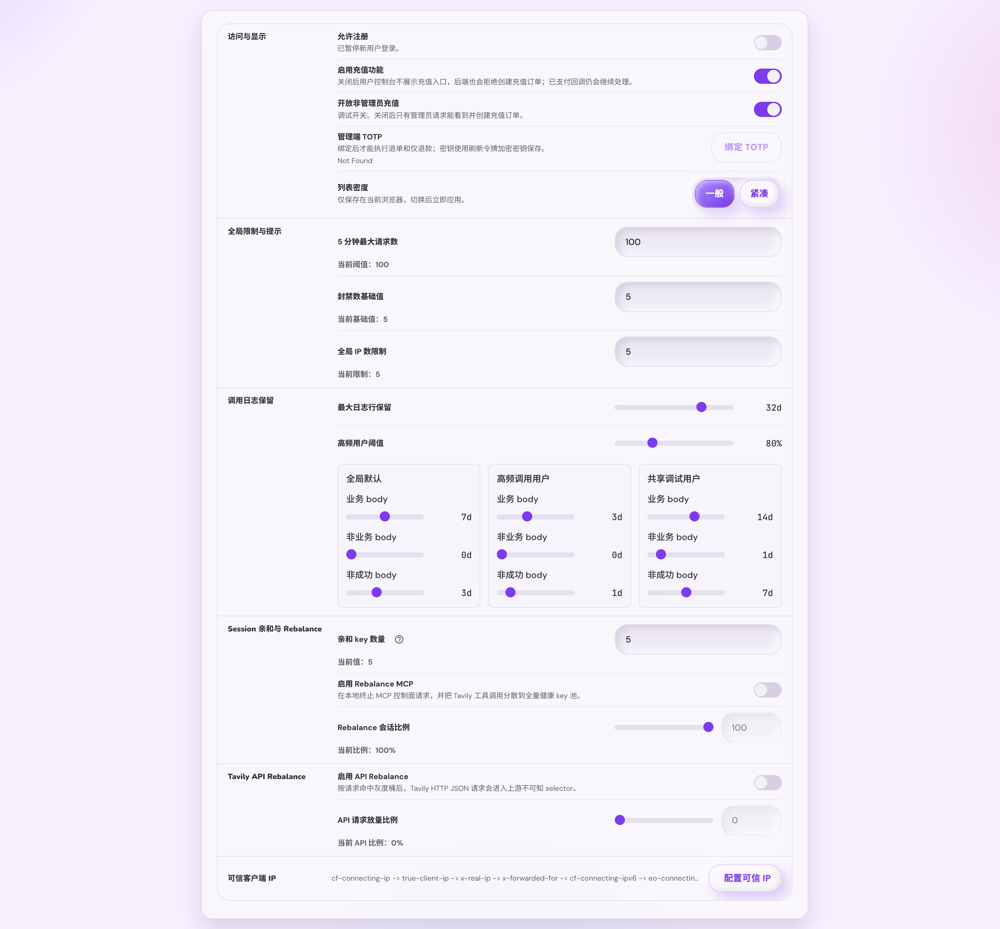
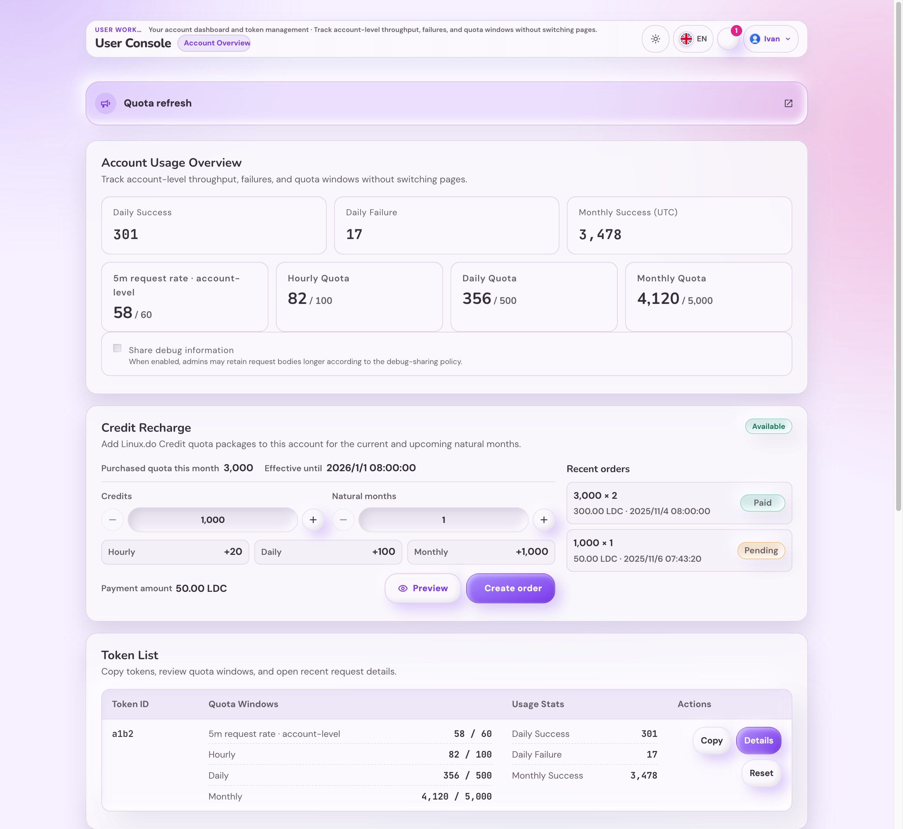

# 请求日志 Body 保留策略与自动清理（#owl2v）

## Status

- Status: 已实现（快车道）
- Created: 2026-06-02
- Last: 2026-06-02

## Background

线上 `request_logs` 数据库增长主要来自低业务价值 MCP control-plane 请求保存完整
`request_body` / `response_body`，尤其 `mcp:tools/list`。现有 `request_logs_gc` 已按行做
有界保留清理，但不能在保留摘要行的同时清掉过期完整 body。

## Goals

- 在 Admin 设置中配置日志行最大保留天数，以及全局 / 高频用户 / 共享调试用户三类完整
  body 保留天数。
- 非业务成功请求默认不保存完整 body，只保留状态、归属、错误摘要与 body 元数据。
- 完整 body 过期后自动清空 BLOB，但保留日志摘要行直到行保留期到期。
- 用户控制台提供“共享调试信息”开关，该开关只决定是否命中共享调试保留条件。
- 历史 body 自动通过既有 `request_logs_gc` 有界追赶机制分批清理。

## Requirements

- `request_logs` 新增 body 元数据：request/response 原始字节数、SHA-256、清理原因、清理时间；
  同时保存 `counts_business_quota`，避免 `mcp:batch` 在 body 清理后丢失业务/非业务分类。
- 行保留与 body 保留分离：行到期删除；body 到期只清空 `request_body` / `response_body`。
- `GET /api/settings` / `PUT /api/settings` 增加 `requestLogRetention`：
  - `maxLogRetentionDays`：`0..92`，默认 `32`。
  - `heavyUsageThresholdPercent`：`50..150`，步进 `10`，默认 `80`。
  - `global` / `heavyUsage` / `debugShared` 三组：
    - `businessBodyDays`
    - `nonBusinessBodyDays`
    - `nonSuccessBodyDays`
  - 所有天数 `0..92`，保存时写回 clamp 到 `maxLogRetentionDays`。
- 默认完整 body 保留：
  - global：业务 `7` / 非业务 `0` / 非成功 `3`
  - heavyUsage：业务 `3` / 非业务 `0` / 非成功 `1`
  - debugShared：业务 `14` / 非业务 `1` / 非成功 `7`
- 业务分类：
  - `api|mcp:search/extract/crawl/map/research`
  - `api:research-result`
  - `mcp:batch` 任一业务即业务。
- 非业务分类：
  - `api:usage`
  - `mcp:initialize`、`mcp:tools/list`、`mcp:ping`
  - `mcp:resources/*`、`mcp:prompts/*`、`mcp:notifications/*`
  - unsupported / unknown / session-delete / third-party tool。
- `result_status != success` 优先走非成功 body 保留天数。
- 高频用户按最近 24 小时内可用额度使用桶识别，当前自然日额度桶作为兼容兜底。
- 同一日志同时命中多个维度时，采用明确优先级：共享调试用户 > 高频调用用户 > 全局默认。
  这样共享调试能延长排障窗口，高频调用用户也能覆盖全局默认以降低 body 增长。
- `auth_token_logs` 继续保留现有 90 天摘要审计策略，不按本轮设置拆分。

## UI

- Admin 设置页新增“调用日志保留”配置区。
- 高频阈值使用线性 slider：`50%..150%`，step `10%`。
- 天数使用非线性卡位 slider：`0, 1, 2, 3, 7, 14, 32, 62, 92`。
- 用户控制台新增“共享调试信息”开关；关闭后不立即同步清理，下一轮自动清理按非共享策略处理。
- 请求详情 body 已清理时展示长度、SHA-256、清理原因与清理时间。

## Acceptance Criteria

- Given 新写入 `mcp:tools/list` 成功日志
  Then `request_body` / `response_body` 默认不保存完整 BLOB，但 body 长度与 SHA-256 已保存。
- Given 新写入业务成功日志
  Then 在命中的完整 body 保留窗口内保存完整 body。
- Given 新写入非 success 日志
  Then body 保留天数来自非成功档，并优先于业务/非业务成功分类。
- Given 用户开启共享调试
  Then 完整 body 保留天数使用共享调试策略。
- Given 用户未开启共享调试且命中高频
  Then 完整 body 保留天数使用高频调用用户策略。
- Given body 已超过保留窗口但日志行未超过最大行保留窗口
  Then 自动 GC 清空 body 并保留摘要行。
- Given 日志行超过最大行保留窗口
  Then 自动 GC 删除该 `request_logs` 行并维持现有外键 unlink 行为。
- Given `auth_token_logs`
  Then 仍按现有 90 天摘要策略保留，不受本轮 request body 设置拆分。

## Test Plan

- Rust: settings 默认值、范围校验与 clamp；业务/非业务/非成功/mixed batch 分类；高频与共享调试匹配；body 元数据写入；GC 清 body 不删行、行到期删除、有界追赶。
- Frontend: Admin settings slider 卡位、保存 payload、clamp 后刷新；用户共享调试开关读写；请求详情 cleaned-body 展示。
- Visual: Storybook 覆盖 Admin 设置页保留策略区与用户控制台开关。
- Flow: `cargo test`、`cd web && bun run build`、视觉证据、review-loop、PR merge-ready。

## Visual Evidence

## References

- `docs/specs/2wdrp-sqlite-write-lock-hardening/SPEC.md`
- `docs/specs/ev4td-admin-recent-requests-performance-copy/SPEC.md`
- `docs/solutions/operations/sqlite-write-lock-contention.md`
- `docs/solutions/operations/sqlite-admin-read-containment.md`
