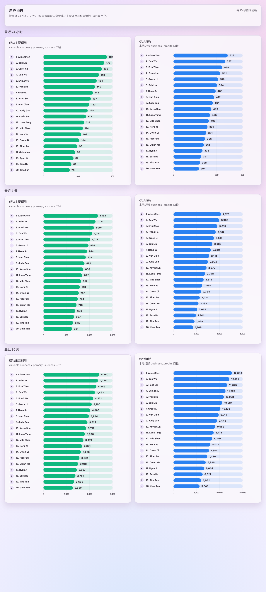
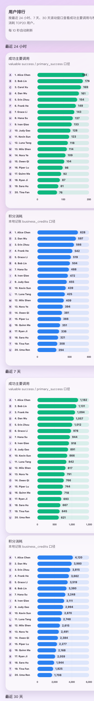

# p7n4k · Admin 用户排行

> 当前有效规范以本文为准；实现覆盖与当前状态见 `./IMPLEMENTATION.md`，关键演进原因见 `./HISTORY.md`。

## Summary

- 新增独立 `/admin/rankings` 管理台模块，固定展示最近 `24h / 7d / 30d` 三个滚动时间窗。
- 每个时间窗固定两张榜：`成功主要调用` 与 `积分消耗`，各取 `TOP20` 用户，按 `value desc, userId asc` 排序。
- 新增 admin-only HTTP 快照 `GET /api/users/rankings` 与独立 SSE `GET /api/users/rankings/events`；SSE 建连首帧即发 `snapshot`，之后每 10 秒推送。
- 排行身份统一返回 `userId / displayName / username / avatarUrl`；前端展示优先级为 `displayName > username > userId`，头像异常时回退为首字母圆牌。
- 后端通过用户级 rollup、partial bucket 补扫与 10 秒 snapshot cache/singleflight 组合支撑滚动窗口，不回退到“每 10 秒扫 30 天原始日志”。

## Scope

- Rust backend
  - 扩展 `account_usage_rollup_buckets.metric_kind`，新增用户级 `primary_success` rollup。
  - `GET /api/users/rankings`
  - `GET /api/users/rankings/events`
  - 用户排行快照缓存、SSE snapshot stream、公开头像安全解析复用。
- Web admin
  - 新增 `rankings` route/nav/module，路径固定 `/admin/rankings`。
  - 新增横向柱状图页面、HTTP 首屏拉取、独立 SSE 活态更新、avatar fallback。
  - 新增 Storybook 页面级 stories 与最小合同测试。
- Docs
  - 本 spec 与 `docs/specs/README.md` 索引登记。

## Data Contract

### `GET /api/users/rankings`

- 返回结构：
  - `generatedAt`
  - `refreshIntervalSecs`
  - `last24h`
  - `last7d`
  - `last30d`
- 每个时间窗固定：
  - `primarySuccessTop`
  - `businessCreditsTop`
- 每个排行 row 固定：
  - `rank`
  - `value`
  - `user`
    - `userId`
    - `displayName`
    - `username`
    - `avatarUrl`

### `GET /api/users/rankings/events`

- `Content-Type: text/event-stream`
- 建连成功后立即发送：
  - `event: snapshot`
  - `data: <same shape as GET /api/users/rankings>`
- 后续固定每 10 秒推送一次 `snapshot`
- 查询失败时发送：
  - `event: degraded`
  - `data: <error message>`

## Metric Semantics

- `primarySuccessTop`
  - 仅统计 `valuable success / primary_success`
  - 使用滚动窗口，不使用自然日或自然月摘要
- `businessCreditsTop`
  - 仅统计本地 `business_credits` 已记账消耗
  - 不引入上游实扣排行
- 用户入榜条件
  - 当前窗口该指标 `value > 0`
  - 不过滤当前 `active` 状态

## UI Constraints

- 桌面端每个时间窗为一个 panel，内部双栏并排展示两张榜。
- 移动端改为纵向堆叠，不允许横向滚动。
- 图表使用 `chart.js + react-chartjs-2` 的标准横向柱状图。
- 每张榜作为单一 chart surface 渲染；身份信息不再拆成图外独立列表。
- 每条 bar 仅展示一份用户身份：`rank + avatar fallback + 单一显示名`，不再重复展示 secondary identity。
- 头像 URL 只使用服务端安全解析后的公开 `avatarUrl`；无头像或加载失败必须回退为首字母圆牌。

## Acceptance

- `/admin/rankings` 作为独立 admin 模块出现在导航中，不影响 `/admin/users/usage` 与 `/admin/tokens/leaderboard`。
- HTTP 与 SSE `snapshot` payload 结构完全一致。
- 24h / 7d / 30d 三个窗口都返回 `primarySuccessTop` 与 `businessCreditsTop` 两榜，且每榜最多 20 行。
- 排序固定为 `value desc, userId asc`。
- SSE 建连后立即收到首帧，并每 10 秒持续推送。
- Storybook 与真实 admin 页面都能证明六张榜的桌面双栏与移动端堆叠布局稳定。

## Visual Evidence

- Storybook: `Admin/Pages/UserRankings`
- Story variants:
  - `Default`
  - `EmptyState`
  - `ErrorState`
  - `Mobile`
- Live page:
  - `/admin/rankings`

### Storybook Default

### Storybook Mobile

### Live Page Route

- `/admin/rankings`
