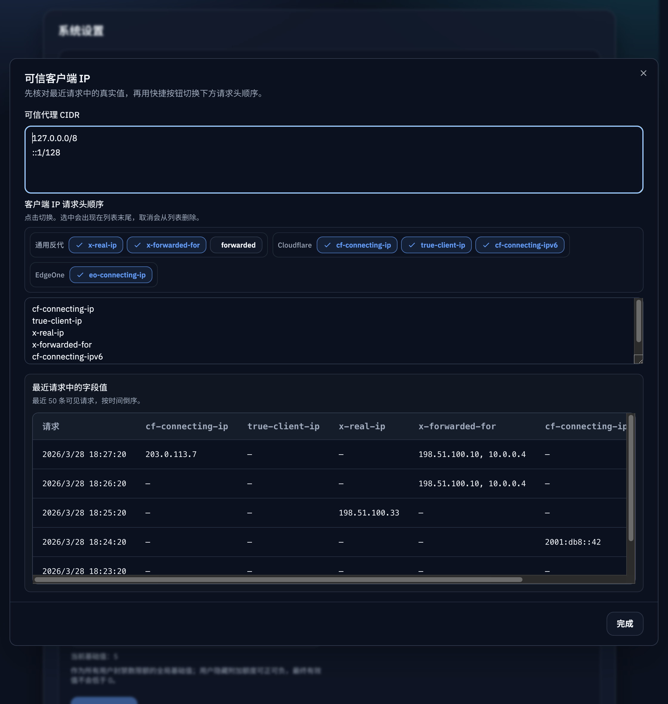
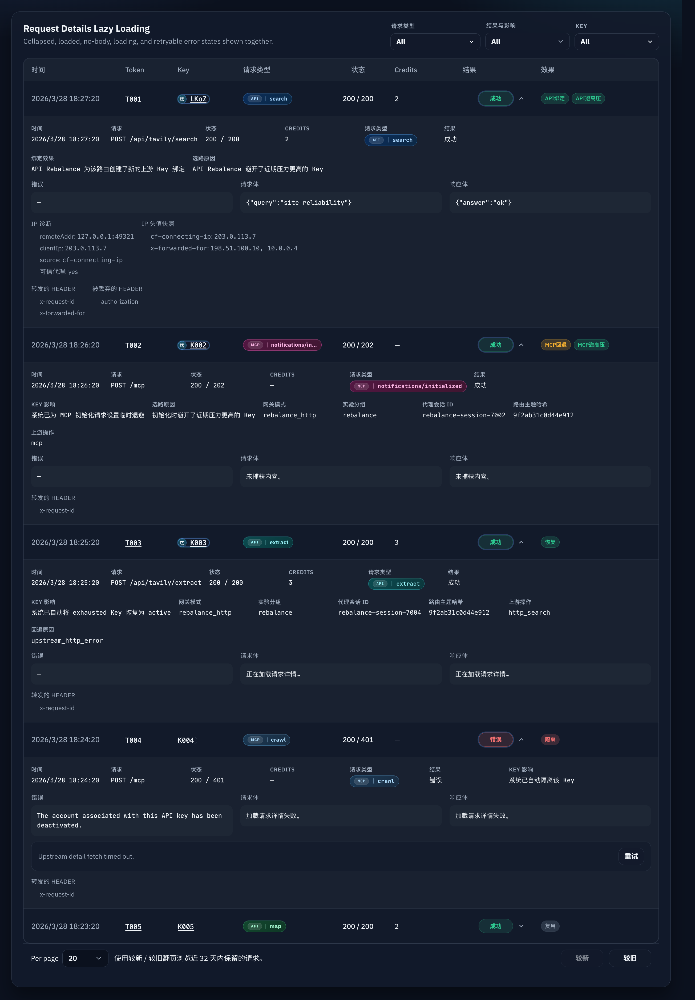
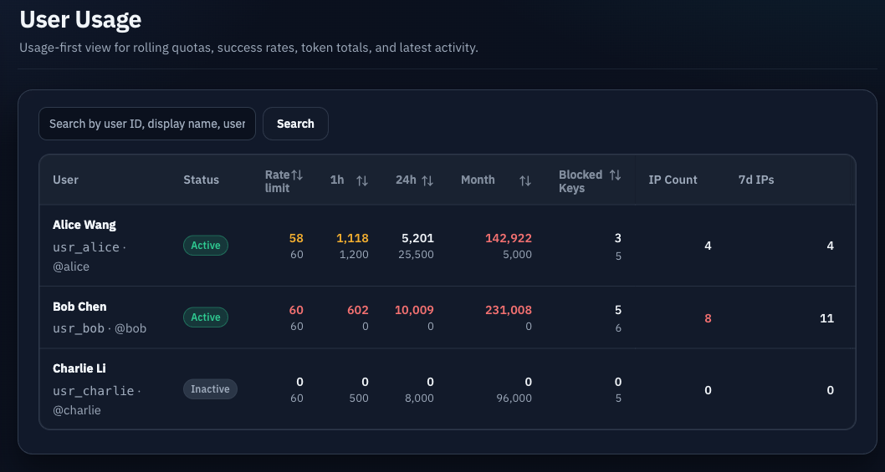
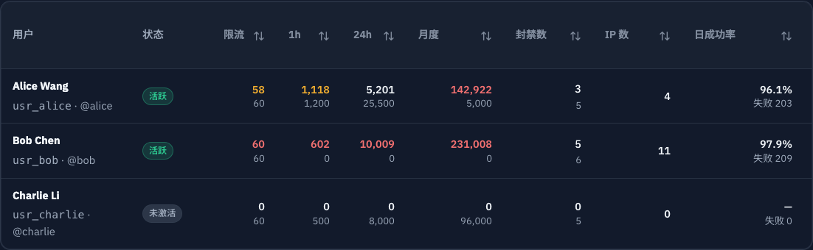
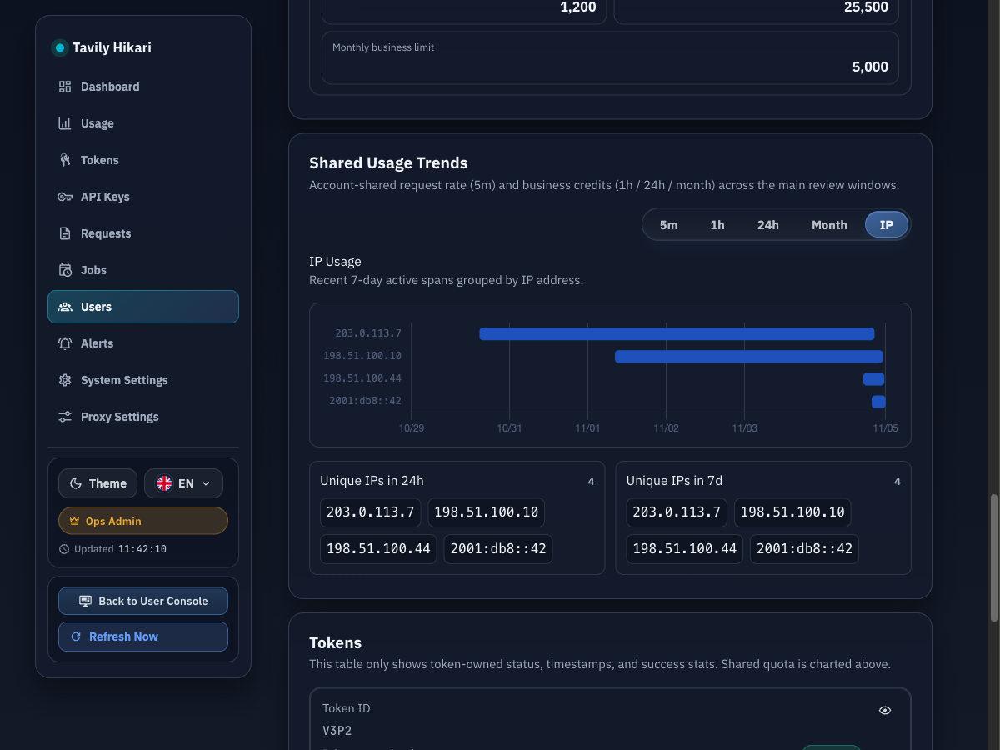
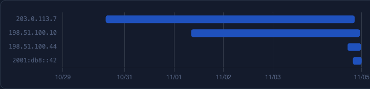
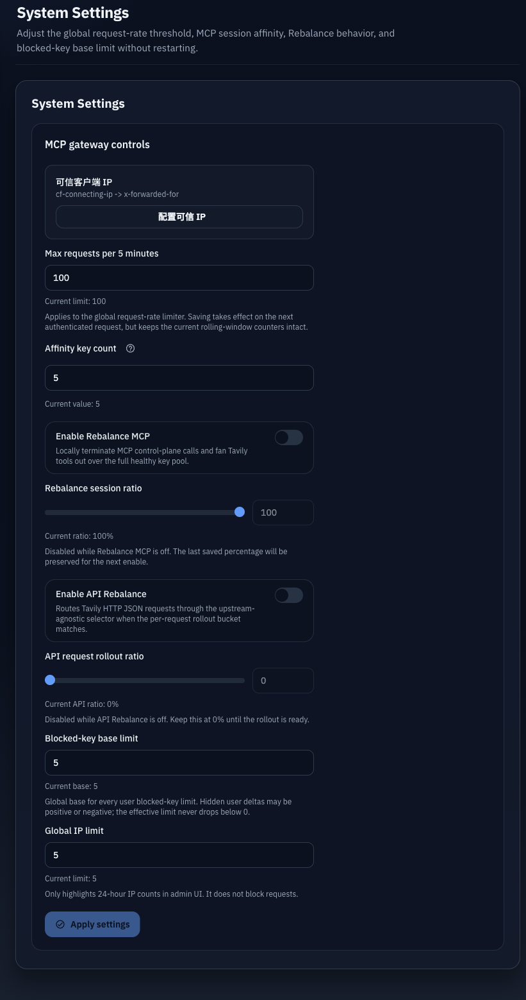

# 7 天用户调用 IP 统计与可信客户端 IP 设置

## Goal

统计最近 24 小时与 7 天去重调用 IP 数，并为管理员提供可信代理 CIDR + 客户端 IP 请求头顺序配置、全局 IP 数提示阈值、近期请求中的实际头值辅助确认，以及用户详情中的 7 天 IP 使用图。

## Scope

- 可信代理 CIDR 与有序 IP 头配置持久化。
- 仅在可信代理命中时解析 `clientIp`，并记录 `remoteAddr`、`clientIpSource`、可信状态与 IP 头快照。
- IP 头快照保存已配置头与安全预设头的并集，便于管理员在启用 Cloudflare、EdgeOne 等头名前回看近期样本。
- 近期请求 IP 诊断只展示有下游/API/tool 调用诊断价值的记录；空 IP 的 rebalance 本地 MCP 控制面日志不得挤占样本列表。
- 默认仅信任 loopback 代理地址；私网或容器网段必须由管理员确认后显式加入。
- 客户端 IP 头配置拒绝 `authorization`、`cookie`、API key 等敏感头名，避免误配置后落库秘密值。
- 用户维度最近 24 小时与 7 天 `COUNT(DISTINCT clientIp)`。
- 系统设置增加全局 IP 数提示阈值，默认 `5`；超过阈值只在管理端标红，不影响鉴权、转发、封禁或限流。
- 系统设置对话框、近期请求 IP 诊断、用户列表/详情 IP 数展示。
- 系统设置对话框中的可信客户端 IP 编辑区只能通过“应用/取消”关闭，不能通过遮罩、Escape 或默认关闭按钮绕过确认。
- 用户详情共享额度趋势 tab 在 `月` 后新增 `IP`，展示最近 7 天 IP 使用情况图，纵轴为 IP 地址，横轴为时间。
- 用户详情展示最近 24 小时与 7 天的唯一 IP 地址列表和数量。

## Non-goals

- 不做自动封禁或阈值拦截。
- 不记录 Authorization、Cookie 等非 IP 敏感头完整值。
- 不回填历史缺失 `client_ip` 的请求日志。

## API Contract

- `GET /api/settings` 的 `systemSettings` 返回 `globalIpLimit`，默认值为 `5`。
- `PUT /api/settings/system` 接受并保存 `globalIpLimit`；旧客户端未传该字段时保持现值。
- `GET /api/users` 和 `GET /api/users/:id` 返回：
  - `recentIpCount24h`
  - `recentIpCount7d`
- `GET /api/users` 支持按 `sort=recentIpCount7d` 排序，供管理端 `IP 数` 列使用。
- `GET /api/users/:id` 额外返回：
  - `recentIpAddresses24h: string[]`
  - `recentIpAddresses7d: string[]`
  - `recentIpTimeline7d: Array<{ ipAddress: string, firstSeenAt: number, lastSeenAt: number, requestCount: number }>`
- 24 小时与 7 天 IP 数量必须保持精确；详情响应中的 IP 地址列表和时间线用于界面抽样展示，按最近活跃 IP 封顶返回，避免高基数用户拖慢详情接口。

## UI Contract

- 用户管理列表和用户用量列表新增单列，列名中文为 `IP 数`，展示最近 7 天去重 IP 总数 `recentIpCount7d`，并支持排序。
- 当 24 小时 IP 数用于详情身份区展示且 `recentIpCount24h > systemSettings.globalIpLimit` 时，仅 24 小时 IP 数值使用红色/危险色提示。
- 用户详情身份区同时展示 24 小时 IP 数与 7 天 IP 数，24 小时值同样按全局阈值标红。
- 用户详情共享额度趋势区的 tab 顺序为 `5m / 1h / 24h / 月 / IP`；`IP` tab 不调用 `usage-series`，使用详情响应中的 IP 时间线数据渲染。
- IP 时间线按 IP 地址分行展示请求活跃区间；无数据时显示稳定空态。
- IP 列表分成最近 24 小时和最近 7 天两组，每组展示最近活跃的唯一 IP 地址样本与精确总数。

## Acceptance

- 后端可安全解析并落盘 IP 审计字段。
- 管理端可编辑可信代理 CIDR 与头顺序，可通过每个头名独立按钮快速追加通用反代、Cloudflare、EdgeOne 等常用头名，并查看近期观测值。
- 管理端编辑可信代理 CIDR 与头顺序时，必须通过“应用/取消”关闭弹窗；取消会丢弃草稿，应用会保存并关闭。
- 近期观测值列表不会被 rebalance 本地 `initialize`、`tools/list`、`ping` 等空 IP 控制面日志刷屏。
- 用户管理列表和用户用量列表可展示最近 7 天去重 IP 数并支持排序；用户详情可展示最近 24 小时与 7 天去重 IP 数，24 小时数超过全局阈值时仅界面标红。
- 用户详情可查看最近 7 天按 IP 分行的时间线，以及最近 24 小时/7 天唯一 IP 列表。
- Recent Requests 可展示 IP 诊断信息与头值快照。

## Visual Evidence

- source_type: storybook_canvas
  story_id_or_title: Admin/SystemSettingsModule/ClientIpDialogWithObservedValues
  scenario: trusted client IP settings dialog with observed header values
  evidence_note: verifies the dialog exposes trusted proxy CIDRs, ordered client IP headers, recent observed header values, and only closes via Apply/Cancel.
  image:
  

- source_type: storybook_canvas
  story_id_or_title: Admin/Components/AdminRecentRequestsPanel/LazyDetailsGallery
  scenario: recent request detail expanded with IP diagnostics
  evidence_note: verifies recent request details show remoteAddr, resolved clientIp, source header, trusted state, and IP header snapshots.
  image:
  

- source_type: storybook_canvas
  story_id_or_title: Admin/Pages/Users
  scenario: sortable 7-day IP count column
  evidence_note: verifies the user management table exposes one IP count column backed by the 7-day unique IP total.
  image:
  PR: include
  

- source_type: storybook_canvas
  story_id_or_title: Admin/Pages/UsersUsage
  scenario: sortable 7-day IP count column
  evidence_note: verifies the user usage table exposes one IP count column backed by the 7-day unique IP total.
  image:
  PR: include
  

- source_type: storybook_canvas
  story_id_or_title: Admin/Pages/UserDetailIpUsage
  scenario: user detail IP tab
  evidence_note: verifies the IP tab after the month tab renders the 7-day IP timeline plus 24-hour and 7-day unique IP lists.
  image:
  

- source_type: storybook_canvas
  story_id_or_title: Admin/Pages/UserDetailIpUsage
  scenario: user detail IP Gantt chart
  evidence_note: verifies the 7-day IP usage view uses the project Chart.js stack as a horizontal Gantt-style chart with IP addresses on the y-axis and time on the x-axis.
  image:
  

- source_type: storybook_canvas
  story_id_or_title: Admin/Pages/SystemSettings
  scenario: global IP limit setting
  evidence_note: verifies system settings expose the global IP limit with default value 5 and UI-only highlighting copy.
  image:
  
